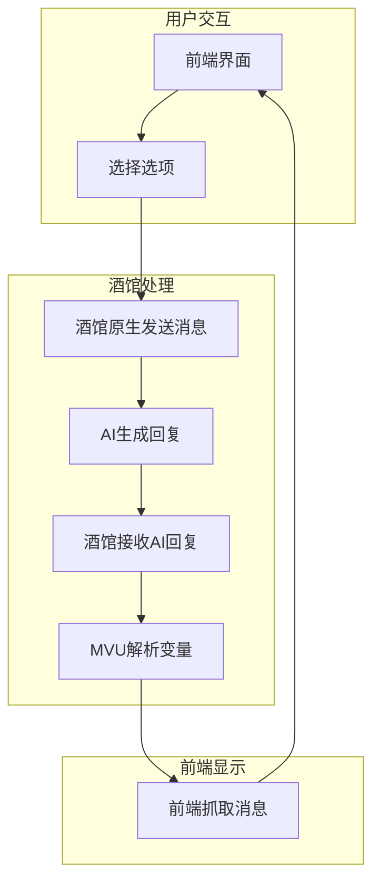
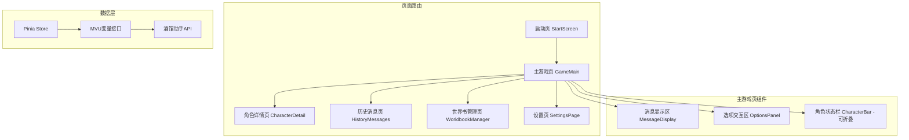

# 同层前端界面设计文档 v2.0

## 一、项目概述

### 1.1 项目目标

设计一个精美的同层前端界面，用于基于LLM的文字交互游戏。该界面需要：

- 提供最大化沉浸式体验的互动式对话窗口
- 打通前端和原生对话界面，正确抓取内容并显示
- 为用户实现各种实用功能
- 符合点兔（请问您今天要来点兔子吗？）的法式艺术风格
- **移动端优先的响应式布局**

### 1.2 核心特性

| 特性       | 描述                                |
| ---------- | ----------------------------------- |
| 启动页面   | Press Start 入口页面，减轻渲染压力  |
| 全屏沉浸式 | 带全屏切换按钮，非全屏按移动端处理  |
| 角色状态   | 可折叠底栏/侧边栏，点击头像展开详情 |
| 选项交互   | 纯选项按钮交互，支持自定义新增选项  |
| 消息显示   | 设置可选，默认即时显示完整内容      |
| 历史消息   | 支持查看历史消息功能                |
| 世界书管理 | 快速查看/调整世界书开关状态         |
| 字体配色   | 设置页可切换字体和配色方案          |

### 1.3 数据流架构（重要）



**关键点**：

- AI回复**不是**直接发送到前端界面
- AI回复先发送到酒馆，然后前端从酒馆抓取显示
- 用户选择选项，实际上是在酒馆内发送了一条消息
- 这样才能实现MVU的完整功能

### 1.4 技术架构



---

## 二、页面设计

### 2.1 启动页面（StartScreen）

**目的**：减轻渲染压力，提供优雅的入口体验

```
┌─────────────────────────────────────────────────────────────┐
│                                                             │
│                                                             │
│                                                             │
│                    ┌─────────────────┐                     │
│                    │   点兔Logo      │                     │
│                    │   (SVG标题)     │                     │
│                    └─────────────────┘                     │
│                                                             │
│                                                             │
│                  ╔═════════════════════╗                   │
│                  ║   Press Start      ║                   │
│                  ╚═════════════════════╝                   │
│                                                             │
│                                                             │
│                      版本信息 v1.0                          │
│                                                             │
└─────────────────────────────────────────────────────────────┘
```

**交互**：

- 点击 "Press Start" 进入主游戏页面
- 显示加载动画
- 背景使用装饰性图案

### 2.2 主游戏页面（GameMain）

**移动端优先设计**（非全屏模式）：

```
┌─────────────────────────────┐
│  ≡  Logo          ⚙️  ⛶    │  ← 顶部导航栏
├─────────────────────────────┤
│                             │
│   ┌─────────────────────┐   │
│   │                     │   │
│   │    消息显示区域     │   │
│   │                     │   │
│   │   AI回复内容呈现    │   │
│   │                     │   │
│   └─────────────────────┘   │
│                             │
├─────────────────────────────┤
│  ┌─────────────────────┐   │
│  │ 选项标题            │   │
│  │ 选项描述...         │   │
│  └─────────────────────┘   │
│  ┌─────────────────────┐   │
│  │ 选项标题            │   │
│  │ 选项描述...         │   │
│  └─────────────────────┘   │
│  [ + 添加自定义选项 ]       │
├─────────────────────────────┤
│  ▼ 角色状态栏（可折叠）     │  ← 点击展开/收起
│  ┌───┐┌───┐┌───┐┌───┐      │
│  │心爱││智乃││理世││...│      │  ← 角色头像
│  └───┘└───┘└───┘└───┘      │
└─────────────────────────────┘
```

**全屏模式**：扩展为宽屏布局，消息区域更宽

### 2.3 角色详情页（CharacterDetail）

```
┌─────────────────────────────┐
│  ← 返回      角色详情       │
├─────────────────────────────┤
│                             │
│   ┌─────────────────────┐   │
│   │                     │   │
│   │    角色立绘         │   │
│   │    (大图)           │   │
│   │                     │   │
│   └─────────────────────┘   │
│                             │
│   心爱                      │
│   ─────────────────────     │
│   心情: 开心 😊             │
│   位置: Rabbit House        │
│   着装: 咖啡厅制服          │
│                             │
│   ──── 关键物品 ────        │
│   • 特制咖啡豆 x1           │
│   • 手写信件 x1             │
│                             │
└─────────────────────────────┘
```

### 2.4 历史消息页（HistoryMessages）

```
┌─────────────────────────────┐
│  ← 返回      历史消息       │
├─────────────────────────────┤
│  [搜索框]                   │
├─────────────────────────────┤
│  ┌─────────────────────┐   │
│  │ 第15楼 - 心爱       │   │
│  │ 消息内容预览...     │   │
│  └─────────────────────┘   │
│  ┌─────────────────────┐   │
│  │ 第14楼 - 用户       │   │
│  │ 消息内容预览...     │   │
│  └─────────────────────┘   │
│  ...                        │
│  [加载更多]                 │
└─────────────────────────────┘
```

**实现方式**：使用 `/messages` 斜杠命令获取历史消息

### 2.5 世界书管理页（WorldbookManager）

```
┌─────────────────────────────┐
│  ← 返回      世界书管理     │
├─────────────────────────────┤
│  [搜索条目]                 │
├─────────────────────────────┤
│  ┌─────────────────────┐   │
│  │ ☑ 保登心爱          │   │
│  │   角色设定条目      │   │
│  └─────────────────────┘   │
│  ┌─────────────────────┐   │
│  │ ☑ 香风智乃          │   │
│  │   角色设定条目      │   │
│  └─────────────────────┘   │
│  ┌─────────────────────┐   │
│  │ ☐ 测试条目          │   │
│  │   已禁用的条目      │   │
│  └─────────────────────┘   │
│  ...                        │
└─────────────────────────────┘
```

**功能**：

- 显示所有世界书条目
- 快速开关条目启用/禁用状态
- 搜索过滤条目

### 2.6 设置页（SettingsPage）

```
┌─────────────────────────────┐
│  ← 返回        设置         │
├─────────────────────────────┤
│                             │
│  ──── 显示设置 ────         │
│  消息显示模式:              │
│  ○ 即时显示（默认）         │
│  ○ 打字机效果               │
│  ○ 分段显示                 │
│                             │
│  ──── 字体设置 ────         │
│  字体方案:                  │
│  ◉ 默认字体                 │
│  ○ 阅读字体                 │
│  ○ 艺术字体                 │
│                             │
│  ──── 配色方案 ────         │
│  ◉ 暖色调（默认）           │
│  ○ 冷色调                   │
│  ○ 高对比度                 │
│  ○ 护眼模式                 │
│                             │
│  ──── 其他设置 ────         │
│  字体大小: [小] [中] [大]   │
│  自动滚动: [开]             │
│                             │
└─────────────────────────────┘
```

---

## 三、视觉设计规范

### 3.1 色彩系统

基于 [`charcolor.css`](src/前端界面/charcolor.css) 中定义的角色代表色：

```css
:root {
  /* 角色代表色 */
  --clr-cocoa: #f5b0b6;   /* 心爱 - 温暖粉色 */
  --clr-chino: #8ab7eb;   /* 智乃 - 清爽蓝色 */
  --clr-rize: #ae96d8;    /* 理世 - 优雅紫色 */
  --clr-chiya: #87ce87;   /* 千夜 - 自然绿色 */
  --clr-syaro: #f5d36e;   /* 纱路 - 明亮黄色 */
  --clr-maya: #7dd4df;    /* 麻耶 - 活力青色 */
  --clr-megu: #f7a699;    /* 惠美 - 柔和橙色 */
  --clr-fuyu: #8d8fd6;    /* 冬优 - 淡雅紫色 */
  --clr-yura: #e58ec4;    /* 结良 - 粉紫色 */
  --clr-natsume: #ce67e8; /* 夏目 - 鲜艳紫色 */
  --clr-eru: #faa548;     /* 艾露 - 橙色 */
  --clr-aoyama: #4778d1;  /* 青山 - 深蓝色 */
  --clr-mate: #4bafd7;    /* 马特 - 天蓝色 */
  --clr-mocha: #b7df69;   /* 摩卡 - 黄绿色 */
}

/* 配色方案预设 */
[data-theme="warm"] {
  --primary-bg: #faf8f5;
  --secondary-bg: #f5f0e8;
  --accent-color: #d4a574;
  --text-primary: #4a4a4a;
  --text-secondary: #7a7a7a;
  --border-color: #e8e0d5;
}

[data-theme="cool"] {
  --primary-bg: #f0f4f8;
  --secondary-bg: #e8f0f8;
  --accent-color: #6b8cae;
  --text-primary: #3a4a5a;
  --text-secondary: #6a7a8a;
  --border-color: #d0dce8;
}

[data-theme="high-contrast"] {
  --primary-bg: #ffffff;
  --secondary-bg: #f5f5f5;
  --accent-color: #1a1a1a;
  --text-primary: #000000;
  --text-secondary: #333333;
  --border-color: #cccccc;
}

[data-theme="eye-care"] {
  --primary-bg: #f5f0e6;
  --secondary-bg: #ebe5d9;
  --accent-color: #8b7355;
  --text-primary: #5a4a3a;
  --text-secondary: #7a6a5a;
  --border-color: #d5cfc3;
}
```

### 3.2 字体规范

```css
:root {
  /* 默认字体 */
  --font-primary: 'Noto Serif SC', 'Source Han Serif CN', serif;
  --font-heading: 'ZCOOL XiaoWei', 'Noto Serif SC', serif;
  --font-ui: 'Noto Sans SC', 'Source Han Sans CN', sans-serif;

  /* 阅读字体 */
  --font-reading: 'LXGW WenKai', 'Noto Serif SC', serif;

  /* 艺术字体 */
  --font-artistic: 'ZCOOL QingKe HuangYou', 'Noto Serif SC', serif;
}

/* 字体方案预设 */
[data-font="default"] {
  --font-body: var(--font-primary);
  --font-title: var(--font-heading);
}

[data-font="reading"] {
  --font-body: var(--font-reading);
  --font-title: var(--font-heading);
}

[data-font="artistic"] {
  --font-body: var(--font-artistic);
  --font-title: var(--font-artistic);
}
```

### 3.3 响应式断点

```scss
// 移动端优先断点
$breakpoints: (
  'mobile': 0,        // 0-767px (默认)
  'tablet': 768px,    // 768px+
  'desktop': 1024px,  // 1024px+
  'wide': 1440px      // 1440px+
);

@mixin mobile {
  @media (max-width: 767px) { @content; }
}

@mixin tablet {
  @media (min-width: 768px) { @content; }
}

@mixin desktop {
  @media (min-width: 1024px) { @content; }
}
```

---

## 四、组件设计

### 4.1 组件清单

| 组件名            | 文件路径                           | 功能描述             |
| ----------------- | ---------------------------------- | -------------------- |
| StartScreen       | `components/StartScreen.vue`       | 启动页面             |
| GameMain          | `components/GameMain.vue`          | 主游戏页面           |
| MessageDisplay    | `components/MessageDisplay.vue`    | 消息显示区           |
| OptionsPanel      | `components/OptionsPanel.vue`      | 选项交互区           |
| OptionCard        | `components/OptionCard.vue`        | 单个选项卡片         |
| CustomOptionInput | `components/CustomOptionInput.vue` | 自定义选项输入       |
| CharacterBar      | `components/CharacterBar.vue`      | 角色状态栏（可折叠） |
| CharacterAvatar   | `components/CharacterAvatar.vue`   | 角色头像组件         |
| CharacterDetail   | `components/CharacterDetail.vue`   | 角色详情页           |
| HistoryMessages   | `components/HistoryMessages.vue`   | 历史消息页           |
| WorldbookManager  | `components/WorldbookManager.vue`  | 世界书管理页         |
| SettingsPage      | `components/SettingsPage.vue`      | 设置页               |
| TopNavBar         | `components/TopNavBar.vue`         | 顶部导航栏           |
| BackgroundLayer   | `components/BackgroundLayer.vue`   | 背景装饰层           |

### 4.2 消息显示区组件

**Props**:

```typescript
interface MessageDisplayProps {
  message: string;
  displayMode: 'instant' | 'typewriter' | 'segment';
  messageId: number;
}
```

**功能**：

- 从酒馆消息楼层获取内容
- 支持三种显示模式
- 解析角色对话并应用对应颜色
- 支持Markdown渲染

### 4.3 选项交互区组件

**数据结构**:

```typescript
interface RoleplayOption {
  id: string;
  title: string;
  content: string;
  isCustom?: boolean;
}

interface OptionsPanelProps {
  options: RoleplayOption[];
  allowCustom: boolean;
}
```

**交互流程**：

1. 用户点击选项
2. 调用 `createChatMessages()` 在酒馆创建用户消息
3. 调用 `triggerSlash('/trigger')` 触发AI生成
4. AI回复发送到酒馆
5. 前端监听并更新显示

### 4.4 角色状态栏组件

**可折叠设计**：

```vue
<template>
  <div class="character-bar" :class="{ collapsed: isCollapsed }">
    <div class="bar-header" @click="toggleCollapse">
      <span class="toggle-icon">{{ isCollapsed ? '▶' : '▼' }}</span>
      <span>角色状态</span>
    </div>
    <div class="bar-content" v-show="!isCollapsed">
      <CharacterAvatar
        v-for="char in currentCharacters"
        :key="char.name"
        :character="char"
        @click="showDetail(char)"
      />
    </div>
  </div>
</template>
```

### 4.5 历史消息组件

**实现方式**：

```typescript
// 使用 /messages 斜杠命令获取历史消息
async function loadHistoryMessages(startId: number, count: number) {
  const messages = await triggerSlash(`/messages ${startId}-${startId + count}`);
  return parseMessages(messages);
}

// 或者使用酒馆助手API
async function loadHistoryMessagesAPI() {
  const chatLength = SillyTavern.chat.length;
  const messages = [];
  for (let i = 0; i < Math.min(chatLength, 50); i++) {
    const msg = getChatMessages(i)[0];
    messages.push(msg);
  }
  return messages;
}
```

### 4.6 世界书管理组件

**实现方式**：

```typescript
// 获取世界书
async function loadWorldbook() {
  const worldbook = await getWorldbook({ type: 'character' });
  return worldbook.entries;
}

// 切换条目状态
async function toggleEntry(uid: string, enabled: boolean) {
  await setWorldbookEntryField({
    file: 'character',
    uid,
    field: 'disable',
    value: !enabled
  });
}
```

---

## 五、资源清单

### 5.1 立绘资源

位于 [`src/界面/assets/portraits`](src/界面/assets/portraits)：

| 文件名      | 角色              | 对应变量名 |
| ----------- | ----------------- | ---------- |
| cocoa.png   | 保登心爱          | 保登心爱   |
| chino.png   | 香风智乃          | 香风智乃   |
| rize.png    | 天天座理世        | 天天座理世 |
| chiya.png   | 宇治松千夜        | 宇治松千夜 |
| syaro.png   | 桐间纱路          | 桐间纱路   |
| maya.png    | 条河麻耶          | 条河麻耶   |
| megu.png    | 奈津惠            | 奈津惠     |
| mocha.png   | 保登摩卡          | 保登摩卡   |
| aoyama.png  | 青山蓝山          | 青山蓝山   |
| mate.png    | 真手凛            | 真手凛     |
| eru.png     | 神沙映月          | 神沙映月   |
| fuyu.png    | 风衣叶冬优        | 风衣叶冬优 |
| yura.png    | 狩手结良          | 狩手结良   |
| natsume.png | 神沙夏明          | 神沙夏明   |

### 5.2 图标资源

位于 [`src/界面/assets/icons`](src/界面/assets/icons)：

| 文件名           | 用途        |
| ---------------- | ----------- |
| logo_shingle.png | Logo图标    |
| title_brown.svg  | 棕色标题SVG |
| title_white.svg  | 白色标题SVG |

### 5.3 装饰图案

位于 [`src/界面/assets/patterns`](src/界面/assets/patterns)：

- 法式花纹背景
- 边框装饰

---

## 六、状态管理

### 6.1 Pinia Store 结构

```typescript
// stores/gameStore.ts
export const useGameStore = defineStore('game', () => {
  // 当前页面状态
  const currentPage = ref<'start' | 'game' | 'character' | 'history' | 'worldbook' | 'settings'>('start');

  // 当前消息
  const currentMessage = ref<string>('');
  const currentMessageId = ref<number>(0);

  // 当前选项
  const options = ref<RoleplayOption[]>([]);

  // 当前场景角色
  const currentCharacters = ref<string[]>([]);

  // UI状态
  const isCharacterBarCollapsed = ref(false);
  const isFullscreen = ref(false);

  return {
    currentPage,
    currentMessage,
    currentMessageId,
    options,
    currentCharacters,
    isCharacterBarCollapsed,
    isFullscreen
  };
});

// stores/settingsStore.ts
export const useSettingsStore = defineStore('settings', () => {
  const settings = ref({
    messageDisplayMode: 'instant' as 'instant' | 'typewriter' | 'segment',
    theme: 'warm' as 'warm' | 'cool' | 'high-contrast' | 'eye-care',
    fontScheme: 'default' as 'default' | 'reading' | 'artistic',
    fontSize: 'medium' as 'small' | 'medium' | 'large',
    autoScroll: true
  });

  // 持久化到 localStorage
  watchEffect(() => {
    localStorage.setItem('gameSettings', JSON.stringify(settings.value));
  });

  return { settings };
});

// stores/characterStore.ts - 使用MVU数据
export const useCharacterStore = defineMvuDataStore(
  Schema,
  { type: 'message', message_id: () => getCurrentMessageId() }
);
```

---

## 七、文件结构规划

```
src/角色卡/界面/同层前端/
├── index.html              # 入口HTML
├── index.ts                # 入口脚本
├── App.vue                 # 主应用组件（含路由）
├── global.scss             # 全局样式
│
├── components/
│   ├── StartScreen.vue         # 启动页面
│   ├── GameMain.vue            # 主游戏页面
│   ├── MessageDisplay.vue      # 消息显示区
│   ├── OptionsPanel.vue        # 选项交互区
│   ├── OptionCard.vue          # 单个选项卡片
│   ├── CustomOptionInput.vue   # 自定义选项输入
│   ├── CharacterBar.vue        # 角色状态栏
│   ├── CharacterAvatar.vue     # 角色头像组件
│   ├── CharacterDetail.vue     # 角色详情页
│   ├── HistoryMessages.vue     # 历史消息页
│   ├── WorldbookManager.vue    # 世界书管理页
│   ├── SettingsPage.vue        # 设置页
│   ├── TopNavBar.vue           # 顶部导航栏
│   └── BackgroundLayer.vue     # 背景装饰层
│
├── stores/
│   ├── gameStore.ts            # 游戏状态
│   ├── settingsStore.ts        # 设置状态
│   └── characterStore.ts       # 角色数据（MVU）
│
├── composables/
│   ├── useMessage.ts           # 消息处理逻辑
│   ├── useOptions.ts           # 选项处理逻辑
│   ├── useCharacters.ts        # 角色状态逻辑
│   ├── useHistory.ts           # 历史消息逻辑
│   ├── useWorldbook.ts         # 世界书管理逻辑
│   └── useFullscreen.ts        # 全屏控制逻辑
│
├── styles/
│   ├── _variables.scss         # 样式变量
│   ├── _mixins.scss            # 样式混入
│   ├── _animations.scss        # 动画定义
│   ├── _themes.scss            # 主题样式
│   └── _decorations.scss       # 装饰样式
│
└── assets/
    ├── portraits/              # 角色立绘（符号链接到 src/界面/assets/portraits）
    ├── icons/                  # 图标资源
    └── patterns/               # 装饰图案
```

---

## 八、实现优先级

### 第一阶段：基础框架

1. 启动页面组件
2. 主游戏页面框架
3. 路由系统
4. 基础样式系统

### 第二阶段：核心功能

1. 消息显示区组件
2. 选项交互区组件
3. MVU数据绑定
4. 酒馆消息同步

### 第三阶段：角色系统

1. 角色状态栏组件（可折叠）
2. 角色详情页
3. 角色数据同步

### 第四阶段：扩展功能

1. 历史消息页
2. 世界书管理页
3. 设置页

### 第五阶段：优化打磨

1. 主题切换
2. 字体切换
3. 动画效果
4. 性能优化

---

## 九、待办事项

- [ ] 网易云音乐iframe外链播放器集成（暂不实现）
- [ ] 存档/读档功能（待讨论）
- [ ] 多语言支持（待讨论）

---

*文档版本: 2.0*
*更新日期: 2026-02-25*
*作者: Kilo Code*
